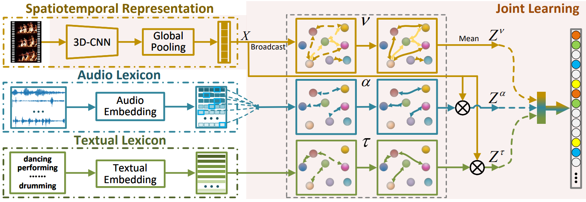

# Multi-Modal Multi-Action Video Recognition

We release the code of the "Multi-Modal Multi-Action Video Recognition" framework proposed in our [ICCV2021 paper](https://openaccess.thecvf.com/content/ICCV2021/papers/Shi_Multi-Modal_Multi-Action_Video_Recognition_ICCV_2021_paper.pdf) and the extended work. 

<div align="center">
   
</div>

The main idea of the framework is to explore multi-action relations via utilizing multi-modal information in videos. We adopt GCN (Graph Convolutional Network) and Transformer Network as the relation learners, and also realize a multi-modal joint learning strategy for multi-action video recognition. The core implementation for the framework are [lib/models/m3a_helper.py](lib/models/m3a_helper.py) and [lib/models/m3a_net_builder.py](lib/models/m3a_net_builder.py).

## Preparation
Please follow the instructions in [PREPARATION.md](PREPARATION.md) for installation and data preparation.

## Get Started
Please refer to [GETTING_STARTED.md](GETTING_STARTED.md) to run the framework.

## Model Zoo
The models and results are provided in [MODEL_ZOO.md](MODEL_ZOO.md).

## License
Please see the [LICENSE](LICENSE) file for more details.

## Acknowledgement
We really appreciate the contributors of following codebases.

- [facebookresearch/SlowFast](https://github.com/facebookresearch/SlowFast)
- [facebookresearch/VMZ](https://github.com/facebookresearch/VMZ)
- [kenshohara/3D-ResNets-PyTorch](https://github.com/kenshohara/3D-ResNets-PyTorch)
- [tkipf/pygcn](https://github.com/tkipf/pygcn)
- [Megvii-Nanjing/ML-GCN](https://github.com/Megvii-Nanjing/ML-GCN)
- [jadore801120/attention-is-all-you-need-pytorch](https://github.com/jadore801120/attention-is-all-you-need-pytorch)

## Citation

```
@inproceedings{shi2021multi,
  title={Multi-Modal Multi-Action Video Recognition},
  author={Shi, Zhensheng and Liang, Ju and Li, Qianqian and Zheng, Haiyong and Gu, Zhaorui and Dong, Junyu and Zheng, Bing},
  booktitle={Proceedings of the IEEE/CVF International Conference on Computer Vision},
  pages={13678--13687},
  year={2021}
}
```
